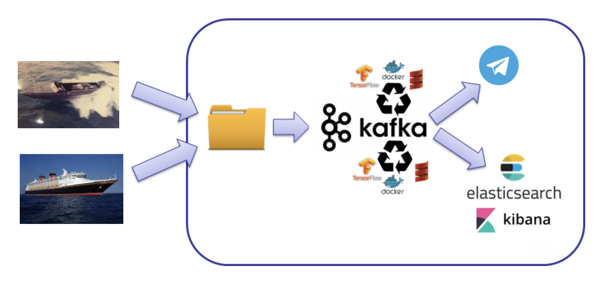
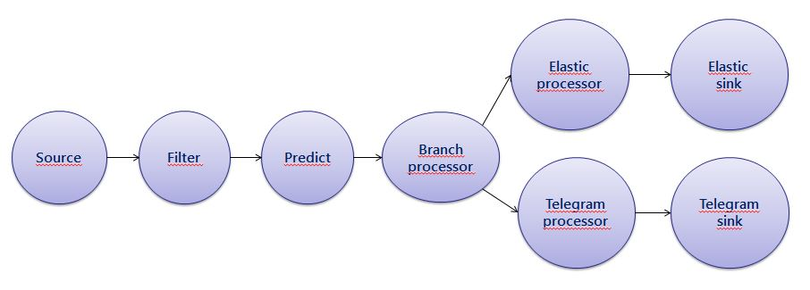

# Kafka Streams end to end demo

Through a hypothetical IoT scenario this project demonstrates how to combine the Kafka Streams API and a Tensorflow image recognition algorithm to predict smuggling activities.

We are using the Tensorflow image classifier algorithm from the [Machine Learning + Kafka Streams example](https://github.com/kaiwaehner/kafka-streams-machine-learning-examples) github repo.

# Architectural overview

See following a diagram with the proposed architecture:



Images of vessels or boats will be uploaded to a folder where a Kafka connect Spooldir connector will pick them up and ingest them all into a Kafka topic. A kafka streams
application will be listening to the upcoming images and will apply an image recognition algorithm implemented in Tensorflow to identify the type of the boat. 

If the boat is identified as a speedboat (potential smuggling activity) an alert will be sent to the Telegram application through a pre-configured Telegram sink connector. If the boat is not identified
as a speedboat the event will be sent to an Elasticsearch cluster and the statistics of events received will be shown through a Kibana dashboard.

The Kafka Streams topology implemented looks as the following:



After getting the events from the source connector (see Connectors set-up section) we filter the events that do not contain a valid image. Then the next processor
will recognize the image and depending on its content (potential smuggling or not) it will send the event to either the ElasticSearch branch or the Telegram one. 

# Requirements, Installation and Usage

Java 8 and Maven 3 are required. Maven will download all required dependencies.

Just download the project and run

```
mvn clean package
```

In order to run the demo Zookeeper, Kafka, Kafka Connect and Confluent Schema Registry are required. As of today the Telegram sink connector is not
compatible with the latest versions of the Confluent platform so the project has been tested using the version 5.0.0 of the platform. Unfortunately this version
is not available within the official Docker confluent github repo so we recommend to download the binaries of the Confluent platform from here: [Confluent platform 5.0.0 binaries](https://packages.confluent.io/archive/5.0/confluent-5.0.0-2.11.tar.gz) and start up all the components
using the following command (included within the bin folder):

```
./confluent start
```

**_Important_**: Before setting up the connectors and start up the Kafka streams application we strongly recommend to create the topics beforehand. Check out the
KafkaConfig file of the project to find out the topics names that must to be created.
 
## Connectors set-up

### Spooldir source connector

New file events must be copied to a folder where a Spooldir source connector will pick them up and ingest into Kafka. The CSV source files will simulate a new event produced by a camera taking pictures of the sea.
See following an example of such a file:

```
camera_id,location,latitude,longitude,timestamp,source_file
id12345,Cadiz - Playa de los Alemanes,36.811696464945555,-6.401511098075663,2020-12-08T08:57:39.431Z,/events/images/speedboat.jpg
``` 

* camera_id: unique id of the camera that took the image
* location: description of the location of the camera
* latitude/longitude: location of the camera
* timestamp
* source_file: route where the Kafka streams app will look for the image

The Spooldir source connector is not included within the Confluent distro so we need to download and install it manually. 

You can download the connector from here: [Kafka connect Spooldir connector](https://www.confluent.io/hub/jcustenborder/kafka-connect-spooldir)
      
After downloading the zip file you must create a new directory (call it kafka-connect-spooldir for instance) within the following one: {confluent.distro.dir}/share/java/. You must unzip the content of the connector
within the directory you have just created and move the jar files that you will find within the lib directoy into the kafka-connect-spooldir, restart the confluent platform and that's it.

Once you have installed the Spooldir source connector, you can both use the Confluent Control Center interface to create the connector (it should be running on http://localhost:9021/) or use the
Kafka connect REST API (by default it will be running on http://localhost:8083) to create it. See following the body of the POST request that should be used to create the connector:

```
{
    "name": "spooldir-source-connector",
    "config": {
        "connector.class": "com.github.jcustenborder.kafka.connect.spooldir.SpoolDirCsvSourceConnector",
		"topic": "image-events-spool",
		"input.path": "INPUT_PATH",
		"finished.path": "FINISHED_PATH",
		"error.path": "ERROR_PATH",
		"input.file.pattern": ".*\\.csv",
        "schema.generation.enabled": "true",
        "schema.generation.key.fields":"camera_id",
		"csv.first.row.as.header":"true"		
		
    }
}
```

You should modify the INPUT_PATH field and include the folder where you will upload the csv files. The FINISHED_PATH is the route where
the connector will automatically move the files after processing them and the ERROR_PATH is the route where the connector will automatically
move the files that contain any errors.

### Telegram sink connector

The alerts for the events that might be considered as potential smugglers will be sent to a Telegram group chat. The Telegram sink connector
is not included within the Confluent distribution so we need to download the zip file from here: [Kafka connect Telegram](https://www.confluent.io/hub/fbascheper/kafka-connect-telegram) . To install the connector please follow the same steps we explained above for the 
Spooldir source connector.

The Telegram connector needs a bot to communicate with. Currently you must use and create your own bot, using Telegram's BotFather. Detailed instructions
to do so can be found in the following github repo: [Github repo Kafka connect Telegram](https://github.com/fbascheper/kafka-connect-telegram)

See following the json body of the POST request you have to send to the Kafka connect REST API to create the connector:

```
{
    "name": "telegram-sink-connector",
    "config": {
        "connector.class": "com.github.fbascheper.kafka.connect.telegram.TelegramSinkConnector",
        "key.converter":"org.apache.kafka.connect.storage.StringConverter",
        "value.converter": "io.confluent.connect.avro.AvroConverter",
        "value.converter.schema.registry.url": "http://localhost:8081",
        "topics": "smuggling-alerts-telegram",
        "telegram.bot.name": "<BOT_NAME>",
		"telegram.bot.username": "<BOT_USER_NAME>",
		"telegram.bot.api.key": "<BOT_API_KEY>",
		"telegram.bot.destination.chat.id": <CHAT_ID>
    }
}
```

### Elasticsearch sink connector

As we mentioned before the incoming image events of vessels that are not recognized as potential smugglers will be sent to an Elasticsearch cluster.

Unfortunately version 7 of Elasticsearch is not compatible with the Confluent 5.0.0 platform so we need to install Elastic 6.x. We recommend to run Elasticsearch
and Kibana using docker. See following the docker run command to start up both components:

```
docker run -d -p 9200:9200 -p 5601:5601 nshou/elasticsearch-kibana:6.5.4
```

When you have Elasticsearch up and running you have to create the index where we will be sending the events. Send the following request to the
Elasticsearch API to create that index:

```
curl -XPUT 'localhost:9200/image-events-elasticsearch?pretty' -H 'Content-Type: application/json' -d'
{
    "settings" : {
        "index" : {
            "number_of_shards" : 1, 
            "number_of_replicas" : 1 
        }
    },
   "mappings": {
    "image-events-elasticsearch": { 
      "properties": { 
        "locationname":    { "type": "keyword", "analyzer": "simple"  }, 
        "predictionlabel":     { "type": "keyword", "analyzer": "simple"  }, 
        "probability":      { "type": "float" },  
        "latitudelongitude":      { "type": "geo_point" },  
        "timestamp":  { "type":   "date"}
      }
    }
  }
}'
```

And finally you have to create the Elasticsearch sink connector. To do so send the following request to the Kafka connect REST API:

```
{
    "name": "elasticsearch-sink-connector",
    "config": {
        "connector.class": "io.confluent.connect.elasticsearch.ElasticsearchSinkConnector",
        "topics": "image-events-elasticsearch",
    "key.converter": "org.apache.kafka.connect.storage.StringConverter",
    "key.ignore": true,
    "type.name": "image-events-elasticsearch",
    "connection.url": "http://localhost:9200"	
    }
}
```


